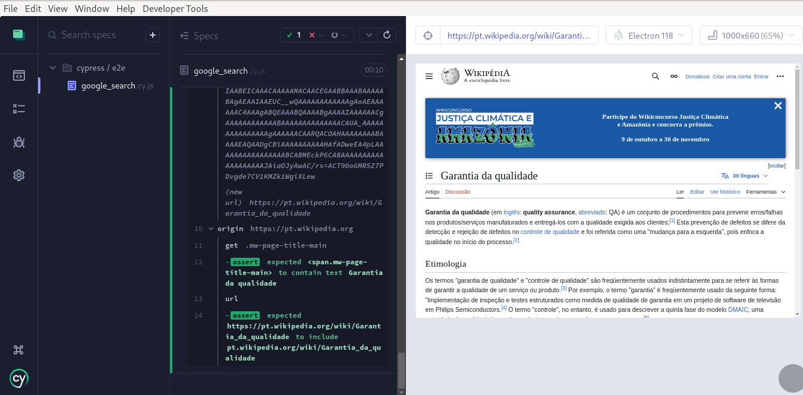
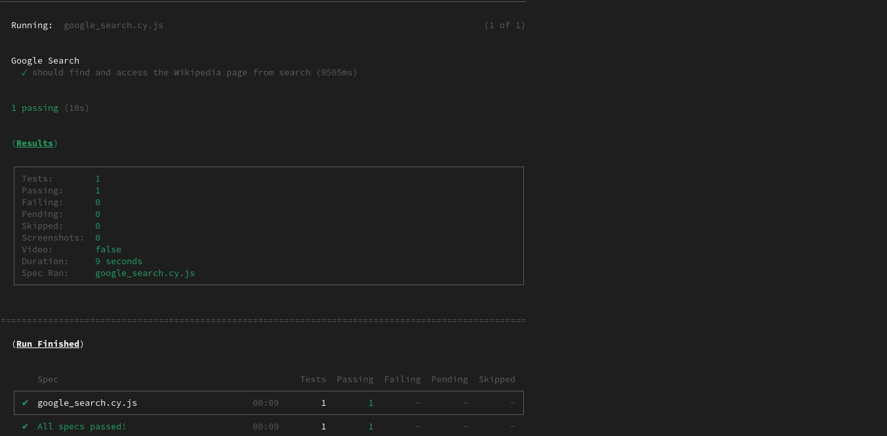

# Challenge Afya

Teste prático de automação com Cypress, focado na criação e automação de testes para páginas dinâmicas, incluindo interações e validação de comportamento em funcionalidades de pesquisa.

## Pre-requitos

É necessário ter o Node.js e o npm instalados para executar este projeto.

As versões utilizadas durante o desenvolvimento foram:
- Node.js: v18.20.3
- npm: 10.7.0
- Cypress 13.15.2

## Preparação do Ambiente

Na pasta do projeto digite `npm install` para instalar todas as dependecias listadas, incluindo o Cypress

## Execução dos Testes

Após instalar as dependências do projeto, incluindo o Cypress, basta usar o comando `npx cypress open` e selecionar a spec google_search para executar no modo interativo.

Caso prefira executar o teste no modo headless use o comando  `npx cypress run` 

## Print de Sucesso do Teste

